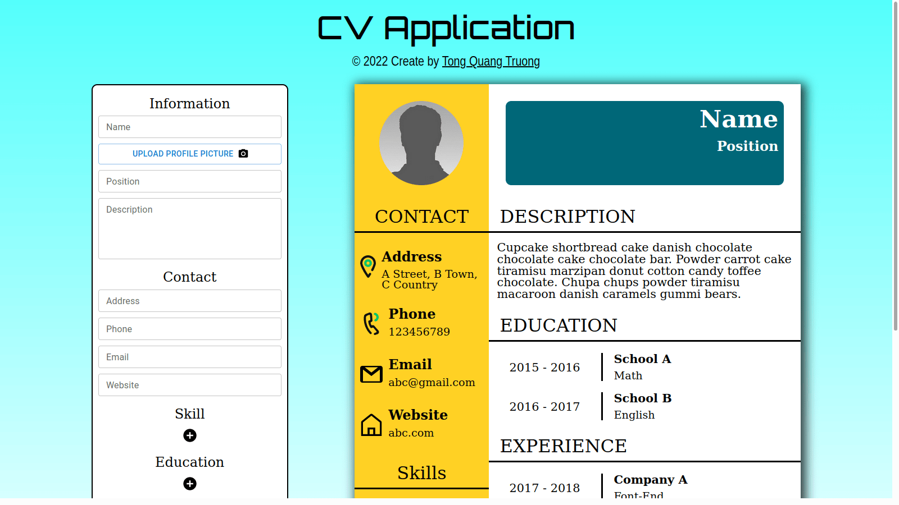

# CV App

## Live Demo

- Build with webpack: https://truongwerk.github.io/CV-Application/
- Build with vite: https://truongwerk.github.io/CV_APP_VITE/



## Features

- Create a CV with: basic info, contacts, skill, education, experience.
- Skill,education, experience can add, change, delete.
- Changes apply instantly.
- Can save your CV to a PDF file.

## Build with

- ReactJS.
- <a href='https://mui.com/' target="_blank" rel="noopener"> MATERIAL-UI</a> and css.
- Use <a href='https://www.npmjs.com/package/react-to-print' target="_blank" rel="noopener">react-to-print</a> library for printing.
- Bundle with webpack and vite.
- Linting with ESlint and prettier.

## Installation

Install with npm

```bash
  npm install
  npm start
```

Open http://localhost:3000 to view it in your browser.

## Deployment

To deploy this project with github page, run:

```bash
  npm run deploy
```

## License

[MIT](https://choosealicense.com/licenses/mit/)
